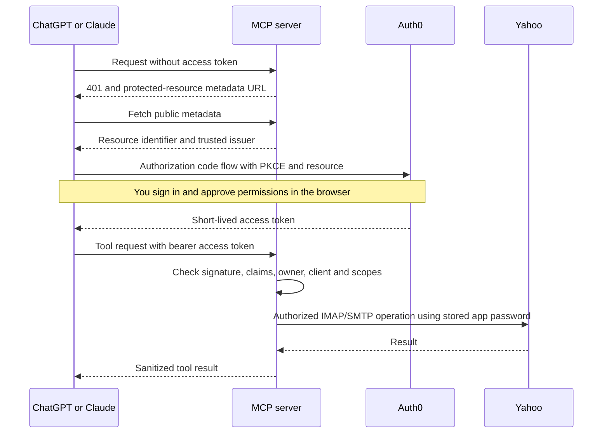

# OAuth for ChatGPT and Claude: design and learning guide

Status: first local increment, September 19, 2026. No cloud authentication settings have been changed. Actual ChatGPT and Claude login flows remain acceptance gates. The user authorized OAuth as an extension to CODEX.md; all mail safety invariants still apply.

## What we are building and why

Today a client presents one shared bearer secret. OAuth replaces that shared credential with a short-lived access token issued after you sign in. Authentication answers who you are; authorization answers what this particular client may do. Both are required because this server controls a single mailbox. A valid login by somebody else must never grant access to it.

Recommended provider: Auth0. It supplies the authorization server, login page, consent, client registration, authorization-code exchange, PKCE support, and refresh-token lifecycle. We remain the resource server: we validate access tokens and enforce mailbox permissions. We do not build a password system or add a database. The Yahoo app password stays in Google Secret Manager; it is never given to ChatGPT, Claude, or the identity provider. OAuth here authorizes access to our MCP service, not a replacement for Yahoo IMAP/SMTP authentication.

Auth0 documents MCP resource identifiers and client registration support. Tenant settings and actual client behavior must still be verified. Enable the Resource Parameter Compatibility Profile where required so the client's `resource` becomes the API audience. Use a dedicated API whose identifier is exactly the canonical HTTPS MCP URL ending in `/mcp`. No assumption about a free plan or its limits is part of this design.

## Flow, step by step

The provider and clients own the browser/code/PKCE steps. Our first increment implements the discovery and token-validation parts. Local tests cannot establish that a real provider has PKCE or callback registration configured correctly.

## Trust decisions implemented locally

| Check | What it prevents |
|---|---|
| RS256 signature checked by jose using configured JWKS | Forged tokens; accepting unsigned tokens or a different algorithm |
| Exact issuer and API audience | Tokens from another provider or intended for another service |
| Exact owner `sub` | Another legitimate Auth0 user accessing your single mailbox |
| Allowed `azp` client IDs | An unapproved client accessing the service |
| Required `iat`, `exp`, maximum 900-second age and lifetime, 5-second clock tolerance | Expired or excessively long-lived credentials |
| `nbf`, when present | Use before a token becomes valid |
| Explicit scopes before tool dispatch | Read access being used to write or send |
| OAuth-only mode without static-secret fallback | Downgrading a failed OAuth check to legacy authentication |

The owner identifier is the immutable provider subject, not a display name or email address. The initial provider profile expects Auth0's `azp` claim. Actual issued tokens must be checked privately against this contract; do not paste tokens into chat. An ID token has the wrong audience and is not a replacement for an API access token.

Only configured HTTPS URLs are used for metadata and signing-key retrieval. Request Host headers and token-supplied URLs never choose an issuer or key server. Public-key retrieval has a five-second timeout, a 30-second refresh cooldown and a ten-minute cache. A cached known key may keep working during a provider outage; a key that cannot be verified fails closed. These cache settings do not provide immediate token revocation. A stolen valid token may remain usable until expiry. Provider refresh-token revocation prevents later refreshes; emergency resource-side shutdown or removal of the allowed subject/client blocks future requests after configuration rollout.

## Permission model

Every authenticated request needs `mail.read`, including discovery of tools and readiness. Readiness checks Yahoo authentication but does not send a message.

| Scope | Tools |
|---|---|
| `mail.read` | search_email, get_email, get_thread, list_folders |
| `mail.read` + `mail.write` | create_draft, update_draft, move_email, archive_email, mark_read, mark_unread, flag_email, trash_email, restore_email, create_folder |
| `mail.read` + `mail.send` | send_email, reply_email |

Missing/invalid credentials return 401 and an OAuth discovery challenge. A valid token lacking permission returns 403 with the required scopes. Unknown tool calls and JSON batch calls are rejected before dispatch. Scope enforcement is on the server, independent of client consent screens. Sending still requires the existing Sent-copy safety gate; a `mail.send` token cannot override it. No new tools, automatic mutation retries, or permanent deletion are introduced.

## Configuration reference

These are deployment settings, not values to paste blindly into the running service:

| Setting | Meaning/example |
|---|---|
| `AUTH_MODE` | `bearer` by default; `oauth-setup` exposes discovery while denying mailbox access; `oauth` enables approved identities |
| `OAUTH_ISSUER` | Exact tenant issuer, including its trailing slash |
| `OAUTH_JWKS_URI` | HTTPS signing-key URL obtained from trusted provider metadata |
| `OAUTH_RESOURCE` | Exact canonical Cloud Run URL plus `/mcp`; also API audience |
| `OAUTH_OWNER_SUB` | Your Auth0 user ID |
| `OAUTH_CLIENT_IDS` | Comma-separated approved ChatGPT and Claude client IDs |

OAuth mode rejects incomplete settings at app construction. `MCP_ACCESS_SECRET` remains required in bearer mode and is not used in OAuth mode. Host/Origin checks remain enabled. Do not use a wildcard to resolve a client compatibility error.

## Agile delivery and definition of done

We deliver small testable slices. For each: write a failing acceptance test (red), add the minimum implementation (green), review/refactor, then run existing regression checks. A passing local slice is not a claim of finished client integration.

1. **Token trust boundary:** implemented and unit tested with real RSA signatures and locally generated dummy identities for both clients.
2. **HTTP discovery and authorization:** implemented; HTTP tests use a controlled verifier to isolate routing and permissions. This is deliberately separate from cryptographic unit tests.
3. **Client protocol integration:** locally tested. Real signed-token MCP workflows exercise all 16 tools for both fixture identities; tool scope metadata, negative requests, key rotation/outage and concurrent authorization tests pass. Real client UI/login behavior remains in slice 5.
4. **Provider configuration:** remaining. Provision tenant, owner, API, scope consent, 15-minute access tokens and separate client registrations; verify authorization-code/PKCE, exact callbacks, refresh rotation, logout/revocation. Avoid guessing redirect URLs: copy those supplied by each actual client.
5. **Staging and client acceptance:** remaining. Build the production Docker image, deploy a reviewable OAuth configuration, reject old bearer tokens, connect ChatGPT and Claude separately, start with folder listing and the designated test email, and confirm long-thread timeout behavior. Retest missing/wrong credentials and scope denial through the cloud edge.

Do not label OAuth production-ready until all five slices pass. The earlier legacy cloud verification does not validate OAuth. Keep the previous Cloud Run revision available for an intentional rollback; never implement automatic authentication downgrade.

## Your next setup step

The tenant and API have been created. Follow [OAUTH_ROLLOUT.md](OAUTH_ROLLOUT.md): deploy discovery in `oauth-setup` first, confirm metadata and 401 challenges, establish the owner and exact client identities, then activate. The server does not need an Auth0 management API token to verify access tokens. Never share passwords, access tokens or client secrets in chat.

## Primary references

- OpenAI: https://developers.openai.com/plugins/build/auth
- MCP authorization specification: https://modelcontextprotocol.io/specification/2025-11-25/basic/authorization
- Auth0 MCP support: https://auth0.com/blog/auth0-auth-for-mcp-servers-generally-available/
- Claude remote connectors: https://support.claude.com/en/articles/11175166-get-started-with-custom-connectors-using-remote-mcp
- jose JWT/JWKS library: https://github.com/panva/jose
